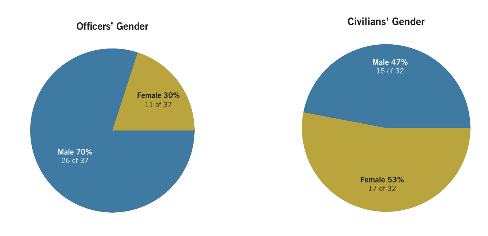

```{r setup, echo = FALSE, cache = FALSE, include = FALSE}
library(flexdashboard)
source("annual_report_2017.R")

# Force
source("analysis/force/force_by_year.R")
source("analysis/force/force_by_month.R")
source("analysis/force/uof_by_type.R")
source("analysis/force/uof_by_reason.R")
source("analysis/force/uof_by_level_and_year.R")
source("analysis/force/uof_pies_each_type.R")
source("analysis/force/uof_by_effectiveness.R")
source("analysis/force/uof_by_district_level.R")
source("analysis/force/uof_by_disposition.R")
source("analysis/force/uof_by_officer_age_exp.R")
source("analysis/force/force_per_officer.R")
source("analysis/force/uof_by_victim_sex_race.R")
source("analysis/force/uof_by_officer_sex_race.R")
source("analysis/force/uof_by_injury.R")
source("analysis/force/uof_against_blacks_comparison.R")

# Officers
source("analysis/officers/officer_demographics.R")
source("analysis/officers/officer_zips.R")

# Allegations
source("analysis/complaints/complaints_allegations_by_year.R")
source("analysis/complaints/allegations_by_type.R")
source("analysis/complaints/top_allegations.R")
source("analysis/complaints/complaints_by_outcome.R")
source("analysis/complaints/complaints_allegation_sex_race_disposition.R")
source("analysis/complaints/complaints_by_disposition_officer_race.R")
source("analysis/complaints/allegations_by_source.R")
source("analysis/complaints/complaints_by_rank_disposition.R")
source("analysis/complaints/complaints_anonymous.R")
source("analysis/complaints/allegations_fourth_amendment.R")
source("analysis/complaints/allegations_retaliation.R")
source("analysis/complaints/allegations_mediation.R")
#source("analysis/caselist.R")

# Actions taken
source("analysis/complaints/actions_taken_by_action.R")
source("analysis/complaints/discipline_by_allegation.R")
source("analysis/complaints/discipline_by_public_sex.R")
source("analysis/complaints/discipline_by_race.R")

# Outreach
source("analysis/oipm_survey.R")

# BWC
source("analysis/bwc/bwc.R") 
```

Introduction {data-orientation=rows}
===================================== 

Row
-------------------------------------
### no title {.no-title}


### Navigating the Report
This website is an interactive version of the statistical analysis from OIPM's 2017 annual report Annual Report. Analysis is divided into these sections:

1. [Complaints & Discipline](#complaints)
2. [Community - Police Mediation Program](#mediation)
3. [Use of Force](#use-of-force)
4. [Officer Demographics](#officers)
6. [Year in Review/Community Outreach](#community-outreach)
7. [Data Sources](#data-sources)


**Download the full reports:**

1. [Year in Review/Community Outreach](http://nolaipm.gov/wp-content/uploads/2018/06/FINAL_Year-in-Review2017.pdf)
2. [Complaints and Discipline](http://nolaipm.gov/wp-content/uploads/2018/06/FINAL_2017-Complaints-and-Discipline-6-29-18-2.pdf)
3. [Use of Force Statistics](http://nolaipm.gov/wp-content/uploads/2018/07/Final_OIPM-UOF-Stats-2017.pdf)
4. [Community-Police Mediation Program](http://nolaipm.gov/wp-content/uploads/2018/06/Final_2017-Annual-Report-Mediation.pdf)
5. [OIPM Use of Force Monitoring & Review Activities](http://nolaipm.gov/wp-content/uploads/2018/06/FINAL_Critical-Incidents-UOF-OIPM-2017-.pdf)


Row
-------------------------------------

### Independent Police Monitor Mission and Responsibilities
The Office of the Independent Police Monitor (OIPM) is an independent, civilian police
oversight agency created by the voters in a 2008 charter referendum and opened its doors for
the first time in August of 2009. Its mission is to improve police service to the community,
civilian trust in the NOPD, and officer safety and working conditions. The OIPM has six
broad responsibilities:

1. To ensure that all complaints regarding police misconduct are classified and
investigated or mediated at the appropriate level and that those investigations are
fairly, timely and thoroughly handled; to ensure that discipline is fair, timely,
appropriate and upheld upon appellate scrutiny. To make information about this
review process available to the public.
2. To monitor NOPD investigations into use of force to identify violations of civil
rights, concerns of officer tactics and safety, risks to life, liberty and property, and
adherence to law and policy.
3. To review and analyze aggregate data from complaints, investigations,
community concerns and public policy in crafting recommendations aimed toward
improving the quality of services by the NOPD.
4. To reach out to inform the community about the OIPM, to listen and respond to
broader community concerns, and prepare the community for engagement in
NOPD policy and practice.
5. To mend police/community relationships by fostering effective
police/community partnerships.
6. To collect police commendations, review and monitor police training and
supervision issues and support a healthy and safe working environment for NOPD
employees.

The OIPM is responsible for monitoring the New Orleans Police Department and only the
New Orleans Police Department. Although OIPM works with other criminal justice system
actors, it is not responsible for oversight of any other agency. However, OIPM is mindful of
the impact of these other criminal justice actors upon the operations of NOPD and will
attempt to analyze that impact in future reports. OIPM accomplishes its mission by focusing
on three main activities: complaint and disciplinary system monitoring and review; use of
force monitoring and review; and subject-specific analyses or audits. The IPM’s
recommendations to improve NOPD’s accountability systems originate from these activities.

Row
-------------------------------------

### Updates & Clarifications (9/17/18)

Since the original publication of this report, several sections have been updated for clarity and clarification.

- Complaints: Removed the word "only" from: "A review of 'Disposition of Rank Complaints' and 'Disposition of Citizen Initiated Complaints' illustrates that, while over 50% of rank complaints are sustained, **only** 15% of complaints initiated by the public are."
- Use of Force: Now using "increase" and "decrease" consistently instead of approximating trends as "flat". No longer assert that the increase in force between 2014 to 2015 is solely attributable to new reporting rules given that the rise continues for UOF through 2016.
- Community Outreach: Respondents could choose multiple concerns, not only one. Consequently the term "greatest concern" has been changed to emphasize that options were not mutually exclusive.

<!-- Column
-------------------------------------
### Reproducing this report

#### tl;dr
```
git clone https://github.com/marvinmarnold/oipm_annual_report
# Install pre-requisites
Rscript run.R
```

#### Source
The data and scripts used to generate this website are available [here](https://github.com/marvinmarnold/oipm_annual_report).

#### Pre-requiites: Installing on Ubuntu 16.04

```
# Dependencies
sudo add-apt-repository -y ppa:opencpu/jq
sudo add-apt-repository -y ppa:ubuntugis/ppa
sudo apt-get update
sudo apt-get install r-base-dev r-base-core libjq-dev libcurl4-openssl-dev libssl-dev libprotobuf-dev libjq-dev libv8-3.14-dev protobuf-compiler libgdal1-dev libgdal1i libproj-dev libudunits2-dev gdal-bin python-gdal python3-gdal libgstreamer-plugins-base0.10-0 libgstreamer0.10-0

# Install pandoc 2 from http://pandoc.org/installing.html#linux

# Get newest versions 
install.packages('devtools')
library(devtools)
devtools::install_github('hadley/ggplot2')
devtools::install_github("hrecht/censusapi")
devtools::install_github('rstudio/leaflet')

# Get stable releases
install.packages(c("dplyr", "tidyr", "ggplot2", "rmarkdown", "plotly", "flexdashboard", "maps", "pandoc", "leaflet", "maptools", "geojsonio"))
```

#### Dependencies
The report was written in Rmarkdown using Rstudio and has the following dependencies that can be installed using `install.packages("LIBRARY_NAME")`:

- dplyr
- tidyr
- ggplot2
- rmarkdown
- flexdashboard
- plotly
- pandoc (read troubleshooting notes)
- maps
- devtools::install_github('rstudio/leaflet')
- geojsonio (on ubuntu, installation fails many times and instructs to install dependencies)

#### Build and run
Once you have all the dependencies installed, you can clone the repository and use Knit in Rstudio to compile `index.Rmd`
in the project's root.

#### Troubleshooting

##### Pandoc
If you have trouble with Pandoc on Linux, check out [these instructions](https://github.com/rstudio/rmarkdown/blob/master/PANDOC.md#newer-systems-debianubuntufedora).

##### geojsonio
sudo apt-get install r-base-dev r-base-core libjq-dev libcurl4-openssl-dev libssl-dev libprotobuf-dev libjq-dev libv8-3.14-dev protobuf-compiler

sudo add-apt-repository -y ppa:opencpu/jq
  sudo apt-get update
  sudo apt-get install libjq-dev libv8-3.14-dev
  
`sudo apt install libgdal1-dev libgdal1i libproj-dev libudunits2-dev` then `install.packages("rgdal", repos = "http://cran.us.r-project.org", type = "source")`. You'll probably also need to update your gdal version:

https://stackoverflow.com/questions/37294127/python-gdal-2-1-installation-on-ubuntu-16-04#41613466

Then finally: `install.packages("geojsonio")`

#### Resources
If you want to get map data for other states, check out: https://github.com/jgoodall/us-maps then convert with ogre.adc4gis.com.
Use the entire ZIP that you download, when converting, don't need to extract. (Alternative = https://github.com/OpenDataDE/State-zip-code-GeoJSON)

LA zip codes http://download.geonames.org/export/zip/ -->

Complaints
=====================================

Row {data-height=400}
-------------------------------------

### **__COMPLAINTS AND DISCIPLINE__**

**[Download the full Complaints and Discipline Report](http://nolaipm.gov/wp-content/uploads/2018/06/FINAL_2017-Complaints-and-Discipline-6-29-18-2.pdf)**

**NOT MOBILE FRIENDLY** *For the best experience, view this website on a desktop computer using full-screen.*

### Police Districts
```{r fig.width = 6, fig.height = 4}
p.police.districts
```


<!-- Row
-------------------------------------
### Complaints vs allegation
When one or more individuals complain about an officer, a single tracking number is created. Each of these unique tracking numbers is considered a single complaint. Each complaint can contain one or more allegations of misconduct. 

Furthermore, its possible that each complaint/allegation is intiated by either a supervisor or anybody who is not their supervisor (including other officers). Complaints/allegations initiated by a superior are called "Rank Initiated" while all other complaints are "Citizen Initiated".

When a complaint/case contains more than one finding, select disposition in this order:

1. Sustained
2. Withdrawn / mediated
3. DI-2
4. Pending
5. Not sustained
6. Unfounded
7. Exonerated
8. NFIM
9. Illegitimate outcome -->

Row {data-height=350}
-------------------------------------
### Complaints by year
```{r, fig.width = 6, fig.height = 6}
p.complaints.by.year
```

### Allegations by year
```{r, fig.width = 6, fig.height = 6}
p.allegations.by.year
```


Row
-------------------------------------
### Title {.no-title}
In 2017, NOPD initiated 734 misconduct investigations. NOPD and OIPM’s data regarding the total number of complaints align. However, OIPM’s data analyst found slightly more (1,546) allegations than what was reported by NOPD (1,505). 

Compared to 2016’s total of 850, this number of complaints represents a 14% decrease in the overall number of complaints filed. Of the allegations contained in those complaints, about 39% were filed by NOPD rank and 61% were filed by members of the public or by NOPD employees against fellow employees. 

Row
-------------------------------------
### **ALLEGATION ANALYSIS**
The following information is about the 734 public and rank initiated complaints. These complaints contained 1,546 allegations – an average of two (2) allegations per complaint. Of those complaints, 450 were marked as public initiated and 284 were marked rank initiated. 

Row
-------------------------------------
### Most common allegations (regardless of outcome)
```{r, fig.width = 4, fig.height = 5}
p.top.alleg
```

### Allegation Types
The five most common complaint allegations in 2017 were:  Neglect of Duty, Professionalism, and Adherence to Law. Neglect of Duty can involve a number of specific violations of policy. The most common specific types of Neglect of Duty were as follows:

**Type of Neglect	- Count**

* Failing to Take Appropriate & Necessary Police Action -	93
* Body Worn Camera, Required Activation - 45
* Failure to Preserve Evidence -	34
* Supervisory Responsibility -	25
* Failing to Make A Written Report When Such Is Indicated - 23
* Report Preparation	- 22
* Vehicle Pursuits - 21
* General -	38
* Failing to comply with instructions, oral or written, from any authoritative source. -	18
* Bias-Free Policing -	15
* Search and Seizure - 14
* Domestic Violence - 26
* In Car Camera Activation - 11


<!-- Row
-------------------------------------
### Most common DI-2 allegations
```{r, fig.width = 4, fig.height = 5}
p.top.di2.alleg
```
--> 

Row
-------------------------------------
### **DISPOSITION ANALYSIS**
The dispositions of the complaints filed in 2017 are illustrated in the figure “Individual Allegations by Outcome.” This figure illustrates, for instance, that the most common allegation “Neglect of Duty” is also the allegation most frequently marked “sustained”. “Disposition of All Complaints” shows the outcomes of all complaints.

Row {data-height=550}
-------------------------------------
### Individual allegations by outcome
```{r, fig.width = 12, fig.height = 8}
p.allegation.by.type.disposition
```

Row {data-height=300}
-------------------------------------
### All complaints by outcome
```{r, fig.width = 5, fig.height = 4}
p.complaint.by.outcome
```

### title {.no-title}
Sustained complaints were the greatest proportion of all complaints because 29% of
them were sustained. The next largest group of outcomes was complaints marked
“unfounded” at 18.3%. The greatest portion of complaints, 29%, are sustained. A
review of “Disposition of Rank Complaints and “Disposition of Citizen Initiated
Complaints” illustrates that, while over 50% of rank complaints are sustained,
15% of complaints initiated by the public are. It is also worthy to note that 6% of
public initiated complaints are mediated by the OIPM’s Community Police Mediation
Program. 

Row {data-height=420}
-------------------------------------
### Citizen complaints by outcome
```{r, fig.width = 5, fig.height = 4}
p.citizen.complaint.by.outcome
```

### Rank complaints by outcome
```{r, fig.width = 5, fig.height = 4}
p.rank.complaint.by.outcome
```

### Most common sustained allegations
```{r, fig.width = 5, fig.height = 4}
p.top.sustained.alleg
```


Row {data-height=450}
-------------------------------------
### Who Complains?
“Allegations by Source” illustrates where complaints come from. A large proportion of complaints, 35.9% are filed by NOPD employees. Some of these are “rank initiated” complaints or supervisors documenting misconduct of supervisees. This number also represents the complaints of peer or lower ranking officers against officers who are of the same or higher rank.

### Allegations by source
```{r, fig.width = 4, fig.height = 7}
p.alleg.by.source
```

### Rank v public complaints
```{r, fig.width = 4, fig.height = 7}
p.complaints.by.rank.disposition
```


Row
-------------------------------------
### Outcomes by Officer Race 
Based on the figure “Impact of Officer Race on Disposition of Complaints”, OIPM found no significant difference in disciplinary outcomes based on officers’ race. Approximately 29% of complaints against African American officers are sustained and 30% for white officers. Future analysis of officer demographics and discipline will consider gender, years of services, and sworn versus civilian employees.

Row 
-------------------------------------
### How officer race impacts disposition
```{r, fig.width = 6, fig.height = 7}
p.allegation.race.disposition
```

### How officer race impacts disposition
```{r, fig.width = 6, fig.height = 7}
p.complaint.disposition.by.officer.race
```

Row
-------------------------------------
### **HIGH RISK ALLEGATIONS**
**Stops, Frisks, Searches and Profiling - Fourth Amendment Protections against Search and Seizure**

When reviewing all complaints filed, OIPM identified 45 complaints containing allegations that appeared to be related to complainants’ Fourth Amendment rights. These complaints were about improper searches, stops without reasonable suspicion, discrimination, and bias based policing.

A brief description of the policies that were violated is below. For more information, you may reference [NOPD's official poilcies](https://www.nola.gov/getattachment/NOPD/Policies/NOPD-Policy-Manual-(1).pdf/). 


- ***Chapter 1.2.4: Search and Seizure***: The federal and state Constitutions both provide every person with the right to be free from unreasonable searches and seizures. This Chapter requires that New Orleans Police Department officers abide by these legal protections when dealing with search and seizure issues, as well as searches of persons in custody.
- ***Chapter 1.3.1.1: Hancuffing and Restraint Devices***: This Chapter governs handcuffing and otherwise restraining suspects during detentions and arrests to provide adequately for the safety and security of the suspect being detained or in custody, the transporting officer, and the public.
- ***Policy 440: Contacts, Detentions and Photographing Detainees***: The purpose of this policy is to establish guidelines for conducting field interviews (FI) and the taking and retention of photographs of persons detained in the field but not arrested.
- ***Policy 402: Discriminatory Policing, Racial Bias-Based Profiling, LGBT Community***

The dispositions of these investigations are detailed as follows:

Row {data-height=600}
-------------------------------------
### Fourth amendment violations
```{r, fig.width = 4, fig.height = 6}
p.fourth.viol
```

### Fourth amendment violations by outcome
```{r, fig.width = 8, fig.height = 6}
p.fourth.viol.outcomes
```

Row {data-height=450}
-------------------------------------
### Anonymous Complaints
Complainants occasionally wish to remain anonymous. It is difficult to determine their reasons, but one of the impetuses for setting up an anonymous complaint process was to address civilian concerns about retaliation when filing complaints. In 2017, two (2) out of 83 contacts received by the OIPM involved anonymous complainants. NOPD recorded ten (10) PIB case numbers associated with anonymous complainants.

### Anonymous complaints
```{r, fig.width = 6, fig.height = 5}
p.anon.allegs
```


Row 
-------------------------------------
### **DISCIPLINE**
The following graphs detail disciplinary outcome by the race and sex of the complainant and then by the race and sex of the officer. This data does not indicate disproportionate outcomes for officers based on their race or sex, but it does indicate that the NOPD is not collecting race or sex information about its complainants in a large number of complaint records. 

Row {data-height=470}
-------------------------------------
### Discipline by Allegation
```{r, fig.width = 12, fig.height = 7}
p.discipline.by.allegation
```


Row {data-height =470}
-------------------------------------
### Discipline by Complainant Sex
```{r, fig.width = 4, fig.height = 5}
p.discipline.by.sex
```

### Discipline by Complainant Race
```{r, fig.width = 4, fig.height = 5}
p.discipline.by.race
```

Row
-------------------------------------
### Discipline by Officer Sex
```{r, fig.width = 4, fig.height = 5}
p.discipline.by.officer.sex
```

### Discipline by Officer Race
```{r, fig.width = 4, fig.height = 5}
p.discipline.by.officer.race
```

Row {data-height=400}
-------------------------------------
### Actions taken
```{r, fig.width = 4, fig.height = 8}
p.actions.taken
```

### Mediation misclassifications
```{r, fig.width = 5, fig.height = 4}
p.mediation
```

Row
-------------------------------------
### title {.no-title}

**[Download the full Complaints and Discipline Report](http://nolaipm.gov/wp-content/uploads/2018/06/FINAL_2017-Complaints-and-Discipline-6-29-18-2.pdf)**


Mediation {data-orientation=rows}
===================================== 

Row
-------------------------------------
### **COMMUNITY-POLICE MEDIATION PROGRAM**

The New Orleans Community-Police Mediation Program is a service provided by the OIPM to improve the relationships between the community and NOPD, allow the NOPD’s Public Integrity Bureau’s (PIB) to reallocate hours spent investigating lower risk complaint allegations to have more resources available to investigate higher risk complaint allegations, and to improve trust in NOPD’s services. The Office of the Independent Police Monitor (OIPM) is an independent, civilian police oversight agency created in August of 2009.  The mission of the OIPM is to improve police service to the community, civilian trust in the NOPD, and officer safety and working conditions. 

Through the development and implementation of best practices, the program quickly became a national model assisting in the development of programs in other cities such as Ferguson and St. Louis, Missouri; Baltimore, Maryland; Los Angeles, California; Chicago, Illinois; and Greenville, North Carolina.  

As part of the OIPM’s mission of public transparency and accountability, this report serves to inform the public on the function and goals of the Community-Police Mediation Program and to evaluate the program’s accomplishments in 2017.

**[Download the full Community-Police Mediation Program Report](http://nolaipm.gov/wp-content/uploads/2018/06/Final_2017-Annual-Report-Mediation.pdf)**

### title {.no-title}


Row
-------------------------------------
### Data on Mediations
**Number and Type of Complaints Referred and Mediated**

In 2017, the Community-Police Mediation Program mediated 32 out of the 77 complaints that were referred to the mediation program from the Public Integrity Bureau (42%).
The 45 complaints that were referred to mediation but not mediated were declined for the following reasons:

* 6 officers declined
* 1 officer declined while another officer accepted (2 officers were named in the complaint), but the complaint could not be bifurcated
* 10 civilians were not reachable with the contact information they provided (phone numbers disconnected, wrong contact information provided, no response to phone calls and emails)
*	2 cases not eligible for mediation due to involvement of litigation with an attorney
*	1 mediation could not be scheduled within the 10-day time frame required by NOPD Policy 1025
*	1 incorrect officer was named by PIB
*	24 civilians declined to mediate for the following reasons: 
  *	Civilian believes in mediation but didn’t think it would help this officer change his behavior.
  *	The civilian didn’t have time to mediate because of family or medical issues. 
  *	Civilian was sick or had other health issues.  
  * Civilian didn’t feel safe in presence of officer. 
  *	Civilian already received an apology from NOPD and felt the matter was resolved.
  * Civilian preferred the complaint be investigated through the traditional complaint investigation process.
  * Civilian feels traumatized and does not wish to talk with officer.
  *	Civilian wants to pursue civil litigation.

Row
-------------------------------------
### **ALLEGATIONS**
In 2017, the majority of complaints referred to mediation were for allegations of Professionalism or Performance of Duty, Neglect of Duty.


Row {data-height=300}
-------------------------------------
### Figure 1: Allegations in Complaints Referred to Mediation from PIB in 2017


### Summary Statistics of Complaints Referred to Mediation:

* 42% of cases referred to the Mediation Program were mediated (32 out of 77 cases).
*	92% of officers agreed to mediate (85 out of 92 officers; Some cases had multiple officers, so the number of officers is greater than the number of cases).
*	56% of the civilians who were reachable agreed to mediate (32 out of 57 civilians).
*	4% of cases referred were ineligible for mediation, so returned to PIB for traditional investigation (3 out of 77 cases; 2 cases involved litigation and 1 had the incorrect officer.
*	The most common types of allegations in cases referred to mediation were Professionalism (73%, 62 out of 85 allegations) and Performance of Duty, Neglect of Duty (22%, 19 out of 85 allegations).

Row
-------------------------------------
### **YEAR TO YEAR COMPARISON**
The following figures illustrate mediation numbers for 2017 in comparison to previous years. It is challenging to draw conclusions at this time, as the number of mediation cases is not large enough for statistical significance, meaning there is not enough data to determine whether differences between the years are “real” or whether they are simply due to chance. However, the OIPM plans to conduct further evaluation and analysis of the year-to-year data at the end of 2018, at which point there will be 5 years’ worth of data and more than 100 cases to evaluate.

Row {data-height=200}
-------------------------------------
### Figure 2: Year to Year Comparison: Percentage of Complaints Mediated of Complaints Referred by PIB


### Figure 3 


Row {data-height=200}
-------------------------------------
### **DEMOGRAPHICS OF MEDIATION PARTICIPANTS**

* In 2017, 32 civilians and 37 police officers participated in mediation sessions through the program. Five of the mediated complaints included two officers, which is why there are five more officers than civilians. 
* Both officers and community members are invited to bring a non-speaking support person to the mediation session and eight community members opted to serve as a support person in a mediation session for an officer or a civilian. 
* The average age of officer participants was 40 years old and the average age of civilian participants was 44 years old.
* The average number of years of NOPD service of the officers who participated was 11 years.


Row {data-height=250}
-------------------------------------
### Figure 4


### Figure 5



Row
-------------------------------------
### Mediator Data – Demographics

In 2017, The New Orleans Community-Police Mediation Program had 22 mediators on its roster. Mediators received an initial 50 hours of CLE-approved mediation training and attend monthly professional development trainings throughout the year to maintain and build their skills. In 2017, the Program provided 12 hours of Professional Development training through in-service mediator training.

### Mediator Demographics 


Row 
-------------------------------------
### **EVALUATION: RESULTS FROM 2017 SURVEYS**
At the end of each mediation session, the officer, civilian, and two mediators are asked to complete surveys. The surveys are anonymous and voluntary and aim to gather feedback to evaluate and improve the program. In addition, thirty days after the mediation, program volunteers administer a longer survey to the officer and civilian by phone to obtain more in-depth, qualitative information regarding their opinion and experience of the mediation process.

Row {data-height=275}
-------------------------------------
### Quantitative Data: Mediator Survey 


Row {data-height=550}
-------------------------------------
### Quantitative Data: Officer Survey


### Quantitative Data: Civilian Survey 


Row
-------------------------------------
### **CONCLUSION**

In 2017, the New Orleans Community-Police Mediation Program continued to create safe spaces for authentic conversation that get to the root of a lack of trust and confidence in NOPD. It also made significant steps towards transforming community-police relationships. 
From participant surveys and anecdotal feedback, mediation has provided benefits for officers, complainants, for the complaint process, and for community policing.  The process has helped by allowing civilians to directly share face-to-face with an officer what they would like policing to look, hear, and feel like in their communities. Officers have received a chance to learn from their mistakes, an opportunity to better understand community needs, and a space to explain their actions and policing, in general, to civilians. Civilians gained greater satisfaction with the complaint process, an opportunity to better understand policing, and a chance to be fully heard and understood. NOPD and PIB benefited from the alternative to the complaint process, with the potential to free up their resources and to have a process that leaves both officers and civilians more satisfied. Ultimately, the New Orleans Community-Police Mediation Program is not only providing a mechanism of civilian police accountability, but helping to increase trust in the police which can create more safety for all. This annual report is a glimpse into the potential of the Community-Police Mediation Program and its impact on community and police relationships in New Orleans. 

**[Download the full Community-Police Mediation Program Report](http://nolaipm.gov/wp-content/uploads/2018/06/Final_2017-Annual-Report-Mediation.pdf)**


Use of Force {data-orientation=rows}
===================================== 

Row {data-height=550}
-------------------------------------
### **STATISTICAL REVIEW OF NOPD'S USE OF FORCE**

The analysis section of the UOF report is split into three sections:

1. Analysis of details pertaining to the NOPD overall.
2. Analysis of details pertaining to groupings of NOPD officers.
3. Analysis of details pertaining to the individuals subjected to NOPD actions.

**[Download the Full Stastical Review of NOPD's Use of Force Report](http://nolaipm.gov/wp-content/uploads/2018/07/Final_OIPM-UOF-Stats-2017.pdf)**

**NOT MOBILE FRIENDLY**
*For the best experience, view this website on a desktop computer using full-screen.*
<!--  --> 

### Police districts
```{r fig.width = 6, fig.height = 6}
p.police.districts
```

Row 
-------------------------------------
### FTN vs UOF
FTN stands for “force tracking number”. It is the designation given to track the entirety
of an interaction between NOPD and one or more individuals wherein force was used.

A single FTN corresponds to one or more UOF. If Officer A and Officer B both use their
hands against Individual C, the result would be one FTN, corresponding to two UOFs
(one for each officer). The same pattern would apply if there were multiple types of
force used or multiple individuals that force was used on.

This report will always clearly label whether FTN or UOF is being used for a particular
analysis but the onus is on the reader to remain vigilant of the distinction.


Row {data-height=390}
-------------------------------------
### Use of Force by Year
```{r force.by.year, fig.width = 10, fig.height = 9}
p.force.by.year
```


### FTN & UOF in 2017 by Month
```{r, fig.width = 10, fig.height = 9}
p.force.by.month
```

 
Row {data-height=300}
-------------------------------------
### Analysis

FTN & UOF by year
* There were 604 FTNs in 2017, up by 15 FTNs from the previous year. UOFs decreased from 1,592 to 1,574.
* OIPM & NOPD have identical data for 2017. 2015 and 2016 still need to be confirmed.
* Force jumps between 2014 and 2015. The next year, UOF continues to climb but FTN does not.
* UOF has been rising but FTN about steady. This means more officers, individuals, types of force
used per force incident.
* 2016 is the first year that the database that OIPM accesses (IAPro) was used. Before then,
historic numbers from NOPD are relied on.
* Furthermore, 2017 is the first year the OIPM has had access to the underlying
database. We worked with NOPD to resolve discrepancies with historic numbers.

FTN & UOF by month
* Figure 2 clarifies the relationship between FTN and UOF.
* There is high variability between the number of FTN and the resulting UOF.
* UOF and FTN peak in Feb and August, corresponding to Mardi Gras and
summertime.
* UOF has its third peak in Nov but FTN is low that month. This leads to an average
UOF/FTN of 4.5 which is around 2-3 the rest of the year.
* What is driving UOF most: citizens, types of force, number of officers?

Row {data-height=650}
-------------------------------------
### Level 1
```{r, fig.height = 6}
p.lvl.by.year[[1]]
```

### Level 2
```{r, fig.height = 6}
p.lvl.by.year[[2]]
```

### Level 3
```{r, fig.height = 6}
p.lvl.by.year[[3]]
```

### Level 4
```{r, fig.height = 6}
p.lvl.by.year[[4]]
```

Row {data-height=370}
-------------------------------------
### Analysis
**Level 1**

* Level 1 force is decreasing.
* Exhibiting firearms has not changed.
* Many officers unholster but don’t point weapon which is not counted as a use of force.

**Level 2**

* Level 2 grew after shrinking the year before.
* Growth attributable to 66% growth in defense tech/take down.

**Level 3** 

* Level 3 doubled from 3 to 6.

**Level 4**

* Level 4 shrunk by 50.
* Driven by reduction of canine bites to zero.

Row
-------------------------------------
### Force by Level and Type of Force 
```{r, fig.width = 10, fig.height = 7}
p.uof.by.type
```

### Force by Level and District
```{r, fig.width = 10, fig.height = 7}
p.uof.by.district.type
```

Row {data-height=230}
-------------------------------------
### Analysis

**Force by level and type of force**

* Level 1 and Level 2 force account for the vast amount of force used.
* Exhibiting firearms accounts for as much force as all other types combined.

**Force by Level and District**

* 7th district and Special Operations have most uses of force.
* 7th has more than Special Operations. Last year it was reversed.
* 1st (Mid City), 4th (Algiers), 5th (Bywater, Treme, 9th ward) have only Level 1 and Level 2 force.

Row
-------------------------------------
### Force by Type and Effectiveness 
```{r, fig.width = 10, fig.height = 6}
p.uof.by.effectiveness
```

### NOPD's Determination of Unauthorized Force
```{r, fig.width = 10, fig.height = 4}
p.uof.by.disposition
```


Row {data-height=340}
-------------------------------------
### Analysis
**UOF EFFECTIVENESS BY TYPE**

* Like last year, all forms of taser use stand out as being least effective.
* NOPD self-determines effectiveness. Not clear what the guidelines are.
* All firearm discharges were deemed effective.
* 59 instances of exhibiting firearms have not been effective. That equals 8%.
* Use of hands not effective 10% of the time.
* How can ‘other’ force always be effective?

**NOPD'S DISPOSITION ON UOF**

* 7 unauthorized instances of force.
* Last year there was only one. 7 is more in line with expectation of 6.
* 140, about 10% have outcomes that don’t make sense.

Row
-------------------------------------
### Level 1
```{r, fig.height = 3}
uof.pies.each.type[[1]]
```

### Level 2
```{r, fig.height = 3}
uof.pies.each.type[[2]]
```

### Level 3
```{r, fig.height = 3}
uof.pies.each.type[[3]]
```

### Level 4
```{r, fig.height = 3}
uof.pies.each.type[[4]]
```

Row {data-height=220}
-------------------------------------
### Analysis
**Level 1**

* Exhibiting firearms is the overwhelming reason for using force.
* Combined with exhibiting tasers, accounts for 75% of low level force.
* 3 times more likely to pull out a weapon than use hands.
* There are about as many Level 1 hands as Level 2 take downs.

**Level 2**

* 77.4% take down.

Row
-------------------------------------
### Reason for Force
```{r, fig.height = 3}
p.uof.by.reason
```

### Reason for Exhibiting Firearms
```{r, fig.height = 3}
p.firearm.by.reason
```

### What Preceded Force
```{r, fig.height = 3}
p.uof.by.service.type
```

Row {data-height=275}
-------------------------------------
### Analysis
**Reason for Force**

* Resisting arrest is the most common reasons for force at 28.2%.
* Other accounts for 18.9% of justifications for force. Other should not be so common. NOPD must be more specific.

**Reason for Exhibiting Firearms**

* 30% firearm exhibits are other.
* This is still bigger than the overall other rate, but a decrease from last year’s staggering 50%.

**What Preceded Force**

* 12.4% of UOFs occur during a traffic stop, 27.8% during arrest, and 33.5% of UOFs
occur during a call for service.

**Percentage of Force by Officers Using the Most Force**
How to read the graph: The vertical axis is percentage and horizontal axis is number of officers. The graph is cumulative, meaning that the top 10 officers includes the top 5 officers. From the graph, the top 10 officers are responsible for 10.38% of all FTN. The top 10 officers are responsible for 13.34% of UOF. There were about 400 officers that used force in 2017 so, the top 500 officers are responsible for 100% of force.

Row
-------------------------------------
### Average Force per Officer
```{r, fig.height = 3}
p.force.per.officer
```

### Percentage of Force by Officers Using Most Force
```{r, fig.height = 3}
p.force.per.bucket
```

Row 
-------------------------------------
### Analysis
**Average Force per Officer**

* Almost identical to last year.
* On average, an NOPD officer will be involved in a force incident once every other year.
* Only considering officers who used force at least once in 2017, the rate is closer to 3 incidents every 2 years.

**Percentage of Force by Officers Using Most Force**

* These results also very similar to 2016.
* About 1/3 (~400+) of officers’ use force.
* Of those, 20 officers account for 20% of force. Unfair to say “bad apples” because many of those officers are in special operations.
* Trend is that UOF is higher than FTN, meaning of officers using force more often, they are also more forceful when they do (more individuals + types). What’s that about?

Row
-------------------------------------
### Contribution to FTN by top 5 officers
```{r, fig.height = 6}
paste("They account for", top.5.ftn.pct, "% of all FTNs")
paste(top.5.ftn.num.male, "are male")
paste(top.5.ftn.min.age, "-", top.5.ftn.max.age, "years old")
paste(top.5.ftn.min.exp, "-", top.5.ftn.max.exp, "years of experience")
paste(top.5.ftn.num.white, "are white,", top.5.ftn.num.black, "are black,", top.5.ftn.num.hispanic, "are hispanic,", top.5.ftn.num.asian, "are asian,", top.5.ftn.num.native, "are native american,", top.5.ftn.num.asian, "are asian, and", top.5.ftn.num.race, "have an unknown race")
top.5.officers.ftn.division
top.5.officers.ftn.unit
```

### Contribution to UOF by Top 5 Officers
```{r, fig.height = 6}
paste("They account for", top.5.uof.pct, "% of all UOFs")
paste(top.5.uof.num.male, "are male")
paste(top.5.uof.min.age, "-", top.5.uof.max.age, "years old")
paste(top.5.uof.min.exp, "-", top.5.uof.max.exp, "years of experience")
paste(top.5.uof.num.white, "are white,", top.5.uof.num.black, "are black,", top.5.uof.num.hispanic, "are hispanic,", top.5.uof.num.asian, "are asian,", top.5.uof.num.native, "are native american,", top.5.uof.num.asian, "are asian, and", top.5.uof.num.race, "have an unknown race")
top.5.officers.uof.division
top.5.officers.uof.unit
```

Row
-------------------------------------
### Contribution to FTN by Top 10 Officers
```{r, fig.height = 7}
paste("They account for", top.10.ftn.pct, "% of all FTNs")
paste(top.10.ftn.num.male, "are male")
paste(top.10.ftn.min.age, "-", top.10.ftn.max.age, "years old")
paste(top.10.ftn.min.exp, "-", top.10.ftn.max.exp, "years of experience")
paste(top.10.ftn.num.white, "are white,", top.10.ftn.num.black, "are black,", top.10.ftn.num.hispanic, "are hispanic,", top.10.ftn.num.asian, "are asian,", top.10.ftn.num.native, "are native american,", top.10.ftn.num.asian, "are asian, and", top.10.ftn.num.race, "have an unknown race")
top.10.officers.ftn.division
top.10.officers.ftn.unit
```

### Contribution to UOF by Top 10 Officers
```{r, fig.height = 7}
paste("They account for", top.10.uof.pct, "% of all UOFs")
paste(top.10.uof.num.male, "are male")
paste(top.10.uof.min.age, "-", top.10.uof.max.age, "years old")
paste(top.10.uof.min.exp, "-", top.10.uof.max.exp, "years of experience")
paste(top.10.uof.num.white, "are white,", top.10.uof.num.black, "are black,", top.10.uof.num.hispanic, "are hispanic,", top.10.uof.num.asian, "are asian,", top.10.uof.num.native, "are native american,", top.10.uof.num.asian, "are asian, and", top.10.uof.num.race, "have an unknown race")
top.10.officers.uof.division
top.10.officers.uof.unit
```

Row
-------------------------------------
### Contribution to FTN by Top 20 Officers
```{r, fig.height = 10}
paste("They account for", top.20.ftn.pct, "% of all FTNs")
paste(top.20.ftn.num.male, "are male")
paste(top.20.ftn.min.age, "-", top.20.ftn.max.age, "years old")
paste(top.20.ftn.min.exp, "-", top.20.ftn.max.exp, "years of experience")
paste(top.20.ftn.num.white, "are white,", top.20.ftn.num.black, "are black,", top.20.ftn.num.hispanic, "are hispanic,", top.20.ftn.num.asian, "are asian,", top.20.ftn.num.native, "are native american,", top.20.ftn.num.asian, "are asian, and", top.20.ftn.num.race, "have an unknown race")
top.20.officers.ftn.division
top.20.officers.ftn.unit
```

### Contribution to UOF by Top 20 Officers
```{r, fig.height = 10}
paste("They account for", top.20.uof.pct, "% of all UOFs")
paste(top.20.uof.num.male, "are male")
paste(top.20.uof.min.age, "-", top.20.uof.max.age, "years old")
paste(top.20.uof.min.exp, "-", top.20.uof.max.exp, "years of experience")
paste(top.20.uof.num.white, "are white,", top.20.uof.num.black, "are black,", top.20.uof.num.hispanic, "are hispanic,", top.20.uof.num.asian, "are asian,", top.20.uof.num.native, "are native american,", top.20.uof.num.asian, "are asian, and", top.20.uof.num.race, "have an unknown race")
top.20.officers.uof.division
top.20.officers.uof.unit
```
Row {data-width=1200}
-------------------------------------
### Force by Officer Age and Experience 

```{r, fig.width = 13, fig.height = 5}
p.uof.by.officer.age.exp
```


Row {data-height=225}
-------------------------------------
### Analysis
**Use of Force by Officer Age and Experience**

* As officers get older, they commit less force.
* Officers 31 - 35 make up 15.6% of the police department but are responsible for over 350 incidents of force.
* In the next age bracket, officers 36 - 40 make up 35% of all police on the force (nearly double the previous bracket), but the amount of force decreases.
* Officers 51 and older make up 28% of the police department but are only responsible for about 100 incidents of force.
* Experience levels are not enough to explain use of force.
* Officers older than 31 tend to have over 5 years of experience but continue to use nonnegligible amounts of force.
* Not yet clear how assignment factors into this. Are older officers in administrative roles where they are less likely to answer calls for service and/or interact with the public?

Row
-------------------------------------
### Officer Injuries During UOF
```{r, fig.width = 5, fig.height = 4}
p.uof.by.officer.injury
```

### Individual Injuries During UOF
```{r, fig.width = 5, fig.height = 4}
p.uof.by.victim.injury
```

Row
-------------------------------------
### Analysis

NOPD police officers face a real risk of injury and death. This is critical to understanding the
context in which officers make decisions to use force. But risk of injury is not unique to
officers. Individuals who are the subjects of police force also face a risk of injury. See “UOF
leading to individual injury” for reference to how UOF injury risk applies to individuals who
are subjected to NOPD use of force.

* Given most force is exhibiting weapons, the injuries when physical force exerted is higher.
* Individuals more likely to be injured because of force.
* Both officers and individuals face a real risk of injury whenever force is used.

Row
-------------------------------------
### UOF by Individual Gender and Race
```{r, fig.width = 5, fig.height = 4}
p.uof.by.victim.sex.race
```

### UOF by Female Individual Race
```{r, fig.width = 5, fig.height = 4}
p.uof.by.female.victim.race
```

### UOF by Male Individual Race
```{r, fig.width = 5, fig.height = 4}
p.uof.by.male.victim.race
```

Row {data-height=100}
-------------------------------------
### Analysis

* Males have force used against them more often.
* Black males have more force used against them than black females.
* Inversely, white females have more force used against them than white males.

Row
-------------------------------------
### Female Individual UOF by Type and Race
```{r, fig.width = 5, fig.height = 5}
p.female.victim.uof.by.type
```

### Male Individual UOF by Type and Race
```{r, fig.width = 5, fig.height = 5}
p.male.victim.uof.by.type
```

Row {data-height=80}
-------------------------------------
### Analysis 

* Black people are most exposed to firearms, but white people get hands.

Row
-------------------------------------
### Force Used Disproportionately Against Black People by Month
```{r, fig.height = 6}
p.black.by.month
```

### Force Used Disproportionately Against Black People by District
```{r, fig.height = 6}
p.black.by.district
```

Row
-------------------------------------
### Analysis of UOF by Officer Gender and Race

* Like last year, force against black people eclipses population, arrests, and stops 11 of
12 months.
* January had a low 52% of force against black people.
* Stops and arrests of black people are moderately stable. However, force has much
more variability and does not seem correlated with the number of stops or arrests.

* All districts except for 1st (Mid city) use force against black people disproportionately
to other metrics.
* 2nd (Broadmoor) and 3rd (Lakeview) are most disproportionate.

Row {data-height=500}
-------------------------------------
### UOF by Officer Gender and Race
```{r, fig.width = 5, fig.height = 4}
p.uof.by.officer.sex.race
```

### UOF by Female Officer Race
```{r, fig.width = 5, fig.height = 4}
p.uof.by.female.officer.race
```

### UOF by Male Officer Race
```{r, fig.width = 5, fig.height = 4}
p.uof.by.male.officer.race
```


Row {data-height=200}
-------------------------------------
### Analysis

* Male officers used more force.
* White males use more force than all other groups even though they only account for
39% of police officers.
* Female officers use force proportional to their representation.
* Male officers have the specific disproportionality of white males using a lot of force.
* White male officers account for 50% of force.

Row
-------------------------------------
### Female Officer UOF by Type and Race
```{r, fig.width = 5, fig.height = 5}
p.female.uof.by.type
```

### Male officer UOF by Type and Race
```{r, fig.width = 5, fig.height = 5}
p.male.uof.by.type
```

Row 
-------------------------------------
### title {.no-title}
**[Download the Full Stastical Review of NOPD's Use of Force Report](http://nolaipm.gov/wp-content/uploads/2018/07/Final_OIPM-UOF-Stats-2017.pdf)**

Officers
===================================== 

Row 
-------------------------------------
### **OFFICER DEMOGRAPHICS** 
**NOT MOBILE FRIENDLY**
For the best experience, view this website on a desktop computer using full-screen.


Row {data-height=450}
-------------------------------------
### Total Number Active Officers
```{r, fig.width = 5, fig.height = 5}
p.active.officers
```

### 2017 Active Officers by Race
```{r, fig.width = 5, fig.height = 5}
p.officers.by.race
```

### 2017 Active Officers by Sex
```{r, fig.width = 5, fig.height = 5}
p.officers.by.sex
```

Row
-------------------------------------
### Where Officers Live by Zip Code
```{r, fig.width = 5, fig.height = 5}
p.officer.map
```

Community Outreach {data-orientation=rows}
===================================== 

Row
-------------------------------------
### **COMMUNITY OUTREACH IN 2017**
**Needs Assessment Survey**
Throughout the year 2017, The OIPM conducting several surveys in which the community
were asked to answer questions about their concerns about NOPD and their priorities for
OIPM. OIPM Collected 886 responses.

OIPM’s primary purpose in conducting this survey was to create an opportunity to engage the
people it contacts in a conversation about policing and police oversight. OIPM’s survey was
successful because it contacted over 800 individuals and was able to discus their thoughts,
concerns and ideas for improving public safety.

Row
-------------------------------------
### **Question 1. What are your greatest concerns about NOPD?**

The first question listed six areas of concern. Each respondent was allowed to select zero or more concerns that applied to them. Those six areas were: “Quality of Homicide Investigations, The Treatment of Juveniles, Officer Response Time, Human Rights Violations, Treatment of Crime Victims, or Other.”
Of the 886 people that answered question #1 relating to homicide investigations:

- 51.7% stated that they are concerned with NOPD's homicide investigations
- 56.5% stated that they are concerned with NOPD's treatment of juveniles
- 65% stated they are concerned with NOPD's officer response time
- 60.3% stated that they are concerned with NOPD's human rights violation
- 45.6% stated that they are concerned with NOPD's treatment of crime victims
- 10.2% stated that they have other areas of concern that were not listed

```{r, fig.width = 3, fig.height = 6}
p.survey.concerned
```


Row
-------------------------------------
### **Question 2: If you were the Police Monitor, what would your priorities be?**

The second question listed five priorities that the community could choose to focus on if they were Police Monitor. Those five priorities were: “Cleaning out the bad apples and making sure NOPD officers are punished for wrongdoing; Helping the public understand NOPD better and identifying areas where NOPD could improve; Helping NOPD leadership see and correct problems; Telling the public about all NOPD’s successes and mistakes; or other.” 

Of the 886 people that answered question #2:

- 68.1% stated that if they were Police Monitor, one of their priorities would be cleaning out the bad apples and making sure NOPD officers were punished for wrongdoing
- 60.5% stated that if they were Police Monitor, one of their priorities would be helping the public understand NOPD better and identifying areas of NOPD improvement
- 59.3% stated that if they were Police Monitor, one of their priorities would be helping NOPD leadership see and correct problems
- 43.6% stated that if they were Police Monitor, one of their priorities would be telling the public about all NOPD’s successes and mistakes
- 5.76% stated that if they were Police Monitor, one of their priorities would be something other than the options provided


```{r, fig.width = 3, fig.height = 6}
p.survey.if.monitor
```

Data Sources {data-orientation=rows}
===================================== 

Row 
-------------------------------------

### Reproducing this report

#### tl;dr
```
git clone https://github.com/marvinmarnold/oipm_annual_report
# Install pre-requisites
Rscript run.R
```

#### Source
The data and scripts used to generate this website are available [here](https://github.com/marvinmarnold/oipm_annual_report).

#### Pre-requiites: Installing on Ubuntu 16.04

```
# Dependencies
sudo add-apt-repository -y ppa:opencpu/jq
sudo add-apt-repository -y ppa:ubuntugis/ppa
sudo apt-get update
sudo apt-get install r-base-dev r-base-core libjq-dev libcurl4-openssl-dev libssl-dev libprotobuf-dev libjq-dev libv8-3.14-dev protobuf-compiler libgdal1-dev libgdal1i libproj-dev libudunits2-dev gdal-bin python-gdal python3-gdal libgstreamer-plugins-base0.10-0 libgstreamer0.10-0

# Install pandoc 2 from http://pandoc.org/installing.html#linux

# Get newest versions 
install.packages('devtools')
library(devtools)
devtools::install_github('hadley/ggplot2')
devtools::install_github("hrecht/censusapi")
devtools::install_github('rstudio/leaflet')

# Get stable releases
install.packages(c("dplyr", "tidyr", "ggplot2", "rmarkdown", "plotly", "flexdashboard", "maps", "pandoc", "leaflet", "maptools", "geojsonio"))
```

#### Dependencies
The report was written in Rmarkdown using Rstudio and has the following dependencies that can be installed using `install.packages("LIBRARY_NAME")`:

- dplyr
- tidyr
- ggplot2
- rmarkdown
- flexdashboard
- plotly
- pandoc (read troubleshooting notes)
- maps
- devtools::install_github('rstudio/leaflet')
- geojsonio (on ubuntu, installation fails many times and instructs to install dependencies)

#### Build and run
Once you have all the dependencies installed, you can clone the repository and use Knit in Rstudio to compile `index.Rmd`
in the project's root.

#### Troubleshooting

##### Pandoc
If you have trouble with Pandoc on Linux, check out [these instructions](https://github.com/rstudio/rmarkdown/blob/master/PANDOC.md#newer-systems-debianubuntufedora).

##### geojsonio
sudo apt-get install r-base-dev r-base-core libjq-dev libcurl4-openssl-dev libssl-dev libprotobuf-dev libjq-dev libv8-3.14-dev protobuf-compiler

sudo add-apt-repository -y ppa:opencpu/jq
  sudo apt-get update
  sudo apt-get install libjq-dev libv8-3.14-dev
  
`sudo apt install libgdal1-dev libgdal1i libproj-dev libudunits2-dev` then `install.packages("rgdal", repos = "http://cran.us.r-project.org", type = "source")`. You'll probably also need to update your gdal version:

https://stackoverflow.com/questions/37294127/python-gdal-2-1-installation-on-ubuntu-16-04#41613466

Then finally: `install.packages("geojsonio")`

#### Resources
If you want to get map data for other states, check out: https://github.com/jgoodall/us-maps then convert with ogre.adc4gis.com.
Use the entire ZIP that you download, when converting, don't need to extract. (Alternative = https://github.com/OpenDataDE/State-zip-code-GeoJSON)

LA zip codes http://download.geonames.org/export/zip/

Row 
-------------------------------------
### Repo includes all data
Clone this repo to download all data. Alternatively, use the links to download each individually.

Row 
-------------------------------------
### Active duty officers
The IAPro DB that OIPM has access to contains officer information that is not always in a useable form or up-to-date.
For the official count of active NOPD officers in 2017, we use data provided by NOPD. But for providing information about
officers involved in specific uses of force or complaints, we use information from the IAPro DB.

#### Info about officers related to each incident
- Source: OIPM direct DB access on May 18, 2018
- Issue: Does not have reliable dates of employment

#### Official count of all active duty officers in 2017
- Source: NOPD pull from ADP on May 11, 2018
- Issue: Can't cross reference with IAPro data
- Issue: Need an independent way to access this information
- Issue: Need rank over time

Row 
-------------------------------------
### Use of Force
2017 is the first year that OIPM has independent access to a copy of the database that contains force information.
We have used the data on data.nola.gov to compare with NOPD's version and cross reference with previously reported numbers.
We are unable to reproduce all of NOPD's previous figures, especially for 2015 where there is a large discrepancy.

#### Direct database access
- Source: OIPM direct DB access on May 18, 2016
- Issue: 2015 data mostly missing. 
- Issue: "Was arrested" field does not appear to be reliable.

#### data.nola.gov
- Issues: Does not contain a unique way to identify officers.

Row  {data-height=200}
-------------------------------------
### Complaints

#### Direct database access
- Source: OIPM direct DB access on May 18, 2016
- Issue: How to identify anonymous complaints
- Issue: How to identify 4th amendment violations.
- Issue: Many things OIPM believes to be illigitimate outcomes.
- Issue: Identifying complaints made by an officer.

Row {data-height=150}
-------------------------------------
### Community outreach

- Source: OIPM survey results

Row {data-height=150}
-------------------------------------
### Arrest

#### OPSO
- Source: OPSO booking information
- Issue: NOPD should not have to rely on OPSO for arrest data
